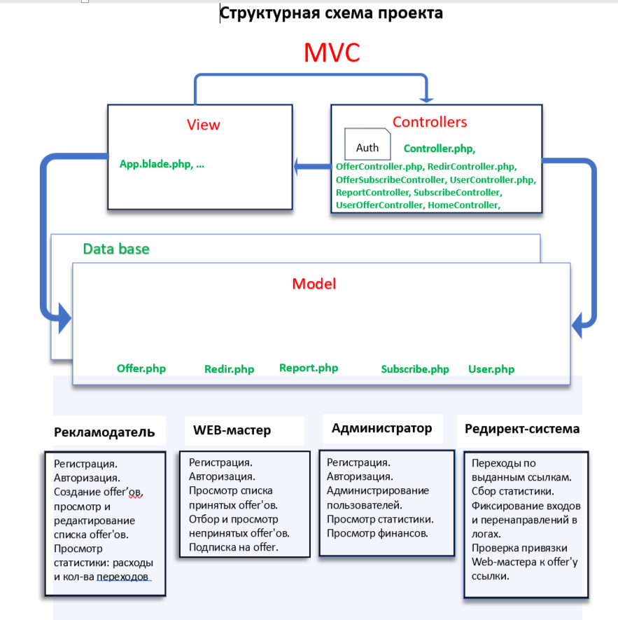

# Трафик-трекер взаимодействия рекламодателей и владельцев сайтов

SkillFactory  PHPDEV Final финальный проект - SF-AdTech

## Описание проекта 

**Система отслеживания рекламного трафика**

Трекер трафика создан для организации взаимодействия компаний (рекламодателей), желающих привлечь посетителей и покупателей (клиентов), и владельцев сайтов (вебмастеров) на свой сайт. Здесь 
[Подробное описание системы.](description.md)

## Используемые технологии

* PHP version 7.4

* Laravel 8.75

* MySQL 8.0

* node.js v18.16.0

* npm 9.8.0

## 

***
**2023@MikeSiebel** [sfadtech project - SF-AdTech](https://github.com/MikeSiebel/sfadtech.git)